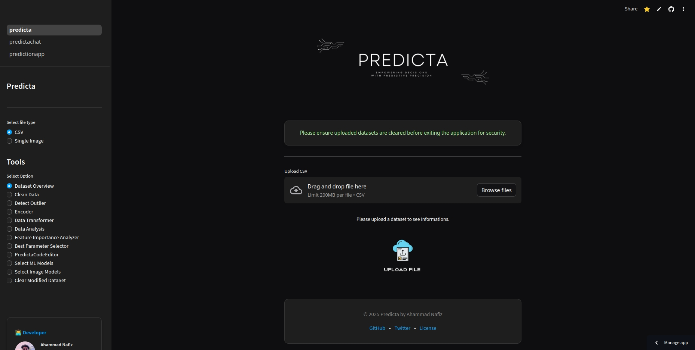

<p align="center">
   <a href="https://www.python.org/">
      
   </a>
   <a href="https://opensource.org/licenses/MIT">
      
   </a>
   <a href="https://streamlit.io">
      
   </a>
   <a href="https://github.com/ahammadnafiz/Predicta/issues">
      
   </a>
   <a href="https://github.com/ahammadnafiz/Predicta/stargazers">
      
   </a>
</p>

<p align="center">
  <a href="https://www.python.org" target="_blank">
    
  </a>
  <a href="https://streamlit.io" target="_blank">
    
  </a>
  <a href="https://scikit-learn.org/" target="_blank">
    
  </a>
  <a href="https://pytorch.org/" target="_blank">
    
  </a>
</p>


> 🚀 Accelerate your data science workflow with an all-in-one machine learning platform

Predicta is a powerful end-to-end data analysis and machine learning toolkit that transforms complex data science workflows into intuitive, streamlined processes. From initial data exploration to model deployment, Predicta empowers both novice and experienced data scientists to build robust predictive models efficiently.



## ✨ Features

### 📊 Advanced Data Analysis
- **Interactive Visualization Suite**: Generate insightful plots and charts
- **Automated Data Profiling**: Quick statistical summaries and data quality checks
- **Pattern Recognition**: Identify correlations and trends effortlessly
- **Missing Data Detection**: Smart identification of data gaps and anomalies

### 🔧 Intelligent Preprocessing
- **Automated Data Cleaning**: Smart handling of missing values and outliers
- **Feature Engineering**: Advanced encoding and scaling techniques
- **Data Validation**: Robust checks for data integrity and consistency
- **Type Inference**: Automatic detection and conversion of data types

### 🤖 Machine Learning Pipeline
- **Algorithm Selection**: Curated collection of ML algorithms for various tasks
- **Hyperparameter Optimization**: Automated model tuning for optimal performance
- **Cross-Validation**: Robust model validation techniques
- **Performance Metrics**: Comprehensive model evaluation suite

### 📈 Production-Ready Features
- **Model Export**: Easy deployment of trained models
- **Batch Prediction**: Efficient processing of large datasets
- **API Integration**: RESTful API for seamless integration
- **Version Control**: Track model versions and experiments

## 🚀 Quick Start

### Prerequisites
- Python 3.8+
- pip package manager

### Installation

1. Clone the repository:
```bash
git clone https://github.com/ahammadnafiz/Predicta.git
cd Predicta
```

2. Create a virtual environment (recommended):
```bash
python -m venv venv
source venv/bin/activate  # Linux/Mac
# or
.\venv\Scripts\activate  # Windows
```

3. Install dependencies:
```bash
pip install -r requirements.txt
```

4. Launch Predicta:
```bash
streamlit run predicta.py
```

## 🤝 Contributing

We love your input! Contribute to Predicta in many ways:

1. Report bugs and feature requests
2. Review source code changes
3. Submit pull requests
4. Help others in discussions

Check out our [Contributing Guidelines](CONTRIBUTING.md) for more details.

## 🗺️ Roadmap

- [ ] Deep Learning Integration
- [ ] AutoML Capabilities
- [ ] Time Series Analysis
- [ ] Natural Language Processing
- [ ] Cloud Deployment Options
- [ ] Real-time Processing

## 📄 License

This project is licensed under the Apache License - see the [LICENSE](https://github.com/ahammadnafiz/Predicta/blob/main/LICENSE) file for details.

## 🌟 Support

⭐️ Star this repo if you find it helpful!

## 📧 Contact

Got questions? Reach out!

- Email: ahammadnafiz@outlook.com

---

<p align="center">Made with ❤️ by Ahammad Nafiz</p>