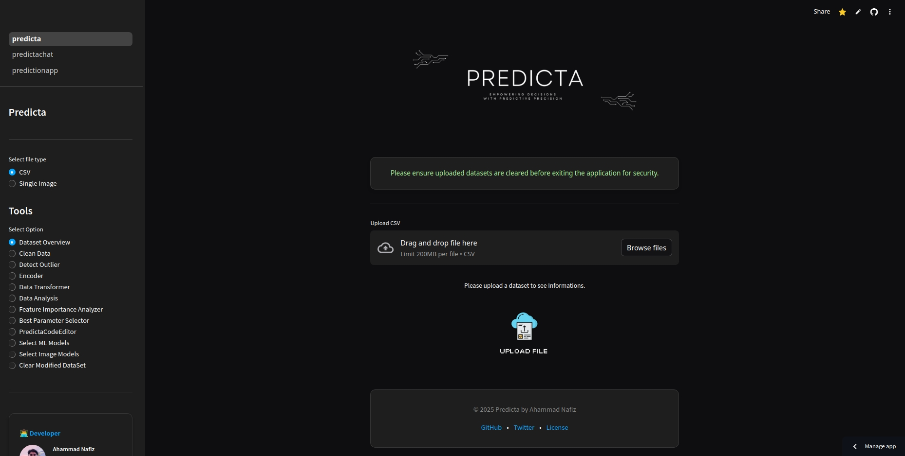

<p align="center">
   <a href="https://www.python.org/">
      
   </a>
   <a href="https://opensource.org/licenses/MIT">
      
   </a>
   <a href="https://streamlit.io">
      
   </a>
   <a href="https://github.com/ahammadnafiz/Predicta/issues">
      
   </a>
   <a href="https://github.com/ahammadnafiz/Predicta/stargazers">
      
   </a>
   <a href="https://pypi.org/project/predicta/">
      
   </a>
</p>

<p align="center">
  <a href="https://www.python.org" target="_blank">
    
  </a>
  <a href="https://streamlit.io" target="_blank">
    
  </a>
  <a href="https://scikit-learn.org/" target="_blank">
    
  </a>
  <a href="https://pytorch.org/" target="_blank">
    
  </a>
</p>


> 🚀 Professional Machine Learning Platform for End-to-End Data Science Workflows

Predicta is a comprehensive, enterprise-grade machine learning platform that transforms complex data science workflows into intuitive, streamlined processes. Built with a modular architecture and professional coding standards, Predicta empowers data scientists to build, deploy, and maintain robust predictive models efficiently.

**🎯 Now featuring professional package structure with CLI interface, centralized configuration, and modular architecture!**



## ✨ Features

### 📊 Advanced Data Analysis
- **Interactive Visualization Suite**: Generate insightful plots and charts
- **Automated Data Profiling**: Quick statistical summaries and data quality checks
- **Pattern Recognition**: Identify correlations and trends effortlessly
- **Missing Data Detection**: Smart identification of data gaps and anomalies

### 🔧 Intelligent Preprocessing
- **Automated Data Cleaning**: Smart handling of missing values and outliers
- **Feature Engineering**: Advanced encoding and scaling techniques
- **Data Validation**: Robust checks for data integrity and consistency
- **Type Inference**: Automatic detection and conversion of data types

### 🤖 Machine Learning Pipeline
- **Algorithm Selection**: Curated collection of ML algorithms for various tasks
- **Hyperparameter Optimization**: Automated model tuning for optimal performance
- **Cross-Validation**: Robust model validation techniques
- **Performance Metrics**: Comprehensive model evaluation suite

### 📈 Production-Ready Features
- **Model Export**: Easy deployment of trained models
- **Batch Prediction**: Efficient processing of large datasets
- **API Integration**: RESTful API for seamless integration
- **Version Control**: Track model versions and experiments

### 🏗️ Professional Package Features
- **CLI Interface**: Command-line tools for easy management
- **Modular Architecture**: Self-contained, reusable components
- **Centralized Configuration**: Professional settings management
- **Advanced Logging**: Comprehensive logging with error filtering
- **Asset Management**: Proper handling of static resources
- **Session Management**: Robust temporary file handling
- **Import System**: Professional absolute import structure
- **Package Installation**: Standard pip-installable package

## 🚀 Quick Start

### Prerequisites
- Python 3.8+
- pip package manager

### Installation

1. Clone the repository:
```bash
git clone https://github.com/ahammadnafiz/Predicta.git
cd Predicta
```

2. Create a virtual environment (recommended):
```bash
python -m venv venv
source venv/bin/activate  # Linux/Mac
# or
.\venv\Scripts\activate  # Windows
```

3. Install the package:
```bash
pip install -e .
```

### Usage

#### Command Line Interface
```bash
# Launch the Streamlit application
predicta run

# Check version
predicta version

# View configuration
predicta config

# Clean temporary files
predicta clean
```

#### Direct Python Usage
```bash
# Launch Streamlit application directly
python -m predicta.app.main

# Or using streamlit
streamlit run predicta/app/main.py
```

## 📁 Project Structure

```
predicta/
├── __init__.py                    # Package initialization
├── cli.py                         # Command-line interface
├── app/                           # Main application
│   ├── __init__.py
│   ├── main.py                    # Streamlit app entry point
│   ├── predicta_app.py           # Core application logic
│   └── pages/                     # Streamlit pages
│       ├── predicta_chat.py
│       ├── predicta_viz.py
│       └── prediction_app.py
├── core/                          # Core infrastructure
│   ├── __init__.py
│   ├── config.py                  # Configuration management
│   ├── logging_config.py          # Logging setup
│   └── streamlit_patches.py       # Compatibility patches
├── modules/                       # Feature modules
│   ├── data_exploration/          # Data analysis and visualization
│   ├── feature_cleaning/          # Data cleaning and preprocessing
│   ├── feature_engineering/       # Feature transformation
│   ├── feature_selection/         # Feature importance and selection
│   ├── ml_models/                 # Machine learning algorithms
│   └── code_editor/               # Code editing capabilities
├── ui/                            # User interface components
│   └── theme/                     # Theming and styling
├── utils/                         # Utility functions
└── assets/                        # Static assets (images, etc.)
```

## 🏗️ Architecture

Predicta follows a modular architecture with clear separation of concerns:

- **Core**: Infrastructure components (config, logging, patches)
- **Modules**: Self-contained feature modules with specific responsibilities
- **UI**: User interface components and theming
- **App**: Main application logic and Streamlit pages
- **CLI**: Command-line interface for easy launching and management

## 🤝 Contributing

We love your input! Contribute to Predicta in many ways:

1. Report bugs and feature requests
2. Review source code changes
3. Submit pull requests
4. Help others in discussions

Check out our [Contributing Guidelines](CONTRIBUTING.md) for more details.

### Development Setup

1. Clone and install in development mode:
```bash
git clone https://github.com/ahammadnafiz/Predicta.git
cd Predicta
pip install -e .
```

2. Install development dependencies:
```bash
pip install -r requirements.txt
```

3. Run tests (when available):
```bash
python -m pytest tests/
```

## 🔧 Configuration

Predicta uses a centralized configuration system:

- **Config Management**: Centralized settings in `predicta/core/config.py`
- **Logging**: Professional logging setup with configurable levels
- **Asset Management**: Centralized asset path management
- **Session Management**: Temporary file handling and cleanup

## 📦 Package Features

- **Professional Structure**: Follows Python packaging best practices
- **Modular Design**: Self-contained modules with clear interfaces
- **CLI Interface**: Easy command-line access to all features
- **Logging System**: Comprehensive logging with PyTorch compatibility
- **Configuration Management**: Centralized settings and path management
- **Asset Management**: Proper handling of static assets and resources

## 🗺️ Roadmap

- [ ] Deep Learning Integration
- [ ] AutoML Capabilities
- [ ] Time Series Analysis
- [ ] Natural Language Processing
- [ ] Cloud Deployment Options
- [ ] Real-time Processing

## 📄 License

This project is licensed under the Apache License - see the [LICENSE](https://github.com/ahammadnafiz/Predicta/blob/main/LICENSE) file for details.

## 🌟 Support

⭐️ Star this repo if you find it helpful!

## 📧 Contact

Got questions? Reach out!

- Email: ahammadnafiz@outlook.com

---

<p align="center">Made with ❤️ by Ahammad Nafiz</p>