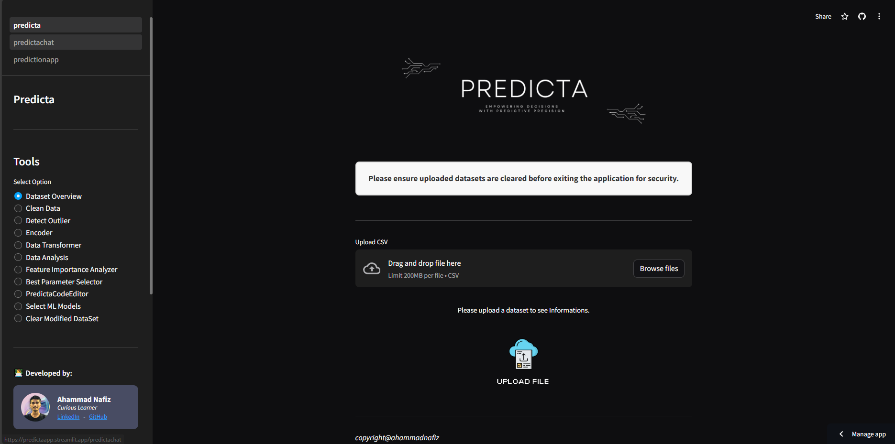

# Predicta

Predicta is an end-to-end data analysis and machine learning tool that simplifies and optimises your data science workflows. From exploratory data analysis (EDA) to data preprocessing and modelling, Predicta offers a comprehensive platform for efficient predictive analytics.



## Key Features

### 1. Exploratory Data Analysis (EDA)
- Visualize and explore your dataset using interactive charts and plots.
- Identify patterns, distributions, and relationships within your data.
- Detect missing values, outliers, and potential data issues.

### 2. Data Preprocessing
- Clean and preprocess your data seamlessly with built-in preprocessing functionalities.
- Handle missing data through imputation or removal strategies.
- Encode categorical variables and scale numerical features.

### 3. Machine Learning Modeling
- Choose from a range of machine learning algorithms for regression, classification, and clustering tasks.
- Optimize model hyperparameters using automated techniques.
- Evaluate model performance using cross-validation and various metrics.

### 4. Streamlined Workflow
- Intuitive user interface guiding you through each step of the data analysis and modelling process.
- Automated feature engineering and selection to enhance model performance.
- Easy deployment of trained models for making predictions on new data.

[](https://youtu.be/LH5vL7mDJrw)

## Installation

To install Predicta, follow these steps:

1. Clone the repository:
   ```
   git clone https://github.com/ahammadnafiz/Predicta.git
   ```

2. Navigate to the project directory:
   ```
   cd predicta
   ```

3. Install dependencies using pip:
   ```
   pip install -r requirements.txt
   ```

4. Run Predicta:
   ```
   streamlit run predicta.py
   ```

## Contributing

We welcome contributions to Predicta! Here's how you can contribute:

- Open a GitHub issue to report bugs or suggest new features.
- Submit a pull request with enhancements or fixes.
- Share your experiences and ideas with us.

## Roadmap

Our roadmap for Predicta includes the following upcoming features and improvements:
- Integration with additional machine learning algorithms and libraries.
- Enhanced visualization capabilities for EDA.
- Support for big data processing and distributed computing.

## Contact

For any inquiries or support related to Predicta, please contact us at ahammadnafiz@outlook.com

---

Thank you for exploring Predicta! We hope this tool simplifies your data analysis and machine learning tasks. Please feel free to reach out with any questions or feedback. Happy modelling!
